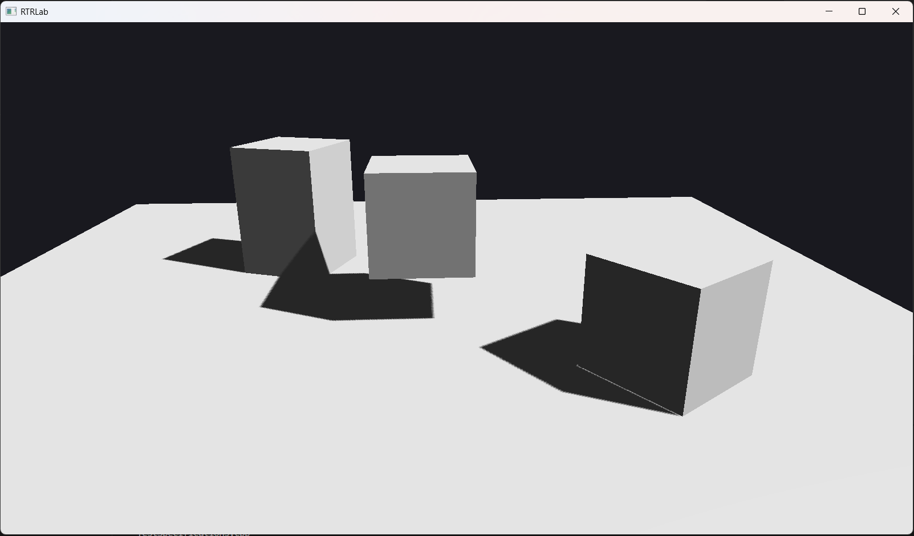
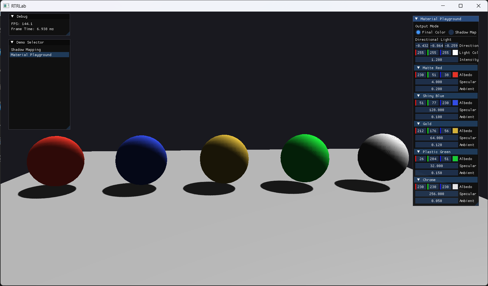

# 实时渲染实验室

一个基于现代 C++ / OpenGL 的图形实验平台，用于探索实时渲染技术与图形算法。

本仓库旨在作为图形实验、学习与可视化的长期开发平台。
它提供了一个轻量级框架，不同的渲染技术可以作为独立的 Demo 进行实现和探索。

[English](../../README.md)

---

## 功能特性

- **Demo 框架** — 模块化架构，每种渲染技术作为独立 Demo 存在，支持运行时热切换
- **多后端图形抽象** — 纯虚接口（`IShader`、`ITexture2D`、`IFramebuffer` 等）+ OpenGL 后端；为 Metal/Vulkan 扩展而设计
- **SPIR-V 着色器管线** — GLSL 源码 → SPIR-V（glslang，构建期）→ 目标 GLSL（SPIRV-Cross，运行时）；单一源码，多后端
- **前向渲染管线** — 多 Pass 渲染器，支持阴影贴图
- **Blinn-Phong 光照** — 环境光 + 漫反射 + 镜面高光，方向光照明
- **阴影贴图** — 方向光深度 Pass，正面剔除 + 斜率偏移 + 3x3 PCF 软阴影
- **材质系统** — Shader + 类型安全 `enum class TextureSlot` 绑定，支持逐物体材质
- **程序化网格** — 内置立方体、平面、全屏四边形、UV 球体生成器
- **ImGui 集成** — 调试面板，显示帧率、内存信息及 Demo 选择器
- **第一人称相机** — WASD + 鼠标控制视角，滚轮调节视场角
- **帧缓冲抽象** — 离屏渲染，支持多颜色/深度附件及像素回读
- **DSA OpenGL** — 采用现代 Direct State Access 风格管理着色器、缓冲区、纹理和帧缓冲

---

## Demo 展示

| Demo | 描述 |
|------|------|
| **[阴影贴图](./demos/shadow-mapping.zh-CN.md)** | Blinn-Phong 光照 + 方向光阴影贴图，3x3 PCF 软阴影、正面剔除及调试可视化 |
| **[材质实验场](./demos/material-playground.zh-CN.md)** | 5 个 UV 球体，各具不同 Blinn-Phong 预设，可通过 ImGui 逐球编辑漫反射色 / 高光度 / 环境光强度 |




---

## 项目结构

```
RT_Rendering_Lab/
├── src/
│   ├── core/           # 核心运行时工具与系统
│   │   ├── app/        # Application、Window、Layer、LayerStack
│   │   ├── event/      # EventBus、Events、ScopedConnection
│   │   └── input/      # Input、InputAction、KeyCode、MouseCode
│   ├── graphics/       # 抽象接口（interface/I*.h）、OpenGL 后端（opengl/GL*）、网格、材质
│   ├── renderer/       # 场景渲染器、ForwardPass、ShadowPass、TexturePreviewPass
│   ├── scene/          # 相机、调试相机控制器、光源、变换、场景数据
│   ├── demos/          # DemoBase、DemoRegistry、LabLayer、ShadowMapping/、MaterialPlayground/
│   ├── gui/            # ImGui 层、调试面板、Demo 选择面板
│   └── main.cpp
├── assets/
│   ├── shaders/        # GLSL 源码（.vert/.frag）+ 编译后的 SPIR-V（.spv）
│   ├── models/
│   ├── textures/
│   └── scenes/
├── tests/
│   ├── unit/           # 单元测试：Time、LayerStack、Transform、Camera、Buffers、CameraController
│   ├── integration/    # 集成测试：Shader、Texture、Framebuffer、RenderTarget（需要 OpenGL 上下文）
│   └── support/        # GLTestContext、MathTestUtils、TestLayer
├── docs/
│   └── roadmap.md
├── vendor/             # 第三方库：GLFW、GLM、ImGui、glslang、SPIRV-Cross（子模块），Glad、STB
└── CMakeLists.txt
```

---

## 构建

### 环境要求

- 支持 C++20 的编译器（MSVC、GCC、Clang）
- CMake 3.20+
- 支持 OpenGL 4.6 的 GPU 及驱动

其余依赖已包含在 `vendor/` 目录中或由 CMake 自动获取。

### 克隆仓库

```bash
git clone --recursive <repository-url>
cd RT_Rendering_Lab
```

> 如果克隆时未使用 `--recursive`，请执行 `git submodule update --init --recursive`。

当前固定的子模块版本：

- `GLFW`：`3.4.0`
- `GLM`：`1.0.3`
- `Dear ImGui`：`1.92.6`（`docking` 分支）
- `glslang`：`vulkan-sdk-1.4.304.1`
- `SPIRV-Cross`：`vulkan-sdk-1.4.304.1`

### 使用预设构建

项目提供了常用配置的 CMake 预设：

```bash
# Visual Studio 2026 — Debug
cmake --preset windows-vs-debug
cmake --build build/windows-vs-debug

# Visual Studio 2026 — 快速调试迭代
cmake --preset windows-vs-debug-fast
cmake --build --preset build-windows-debug-fast --parallel

# Ninja — Release
cmake --preset ninja-release
cmake --build build/ninja-release

# Ninja — 快速调试迭代（需要本机安装 Ninja）
cmake --preset ninja-debug-fast
cmake --build --preset build-ninja-debug-fast
```

`windows-vs-debug-fast` 和 `ninja-debug-fast` 用于缩短日常开发的“修改-编译-运行”循环，默认会启用以下配置：

- 关闭测试构建：`GLAB_BUILD_TESTS=OFF`
- 开启 unity build：`GLAB_ENABLE_UNITY_BUILD=ON`
- 开启预编译头：`GLAB_ENABLE_PCH=ON`
- 不编译 Dear ImGui 的 `imgui_demo.cpp`：`GLAB_BUILD_IMGUI_DEMO=OFF`

为了兼顾稳定性，unity build 会跳过少量 OpenGL / GLFW 相关源文件，避免头文件包含顺序带来的冲突，同时保留大部分提速收益。

### 手动构建

```bash
cmake -B build -DCMAKE_BUILD_TYPE=Release
cmake --build build
```

### 运行

```bash
./build/<config>/RTRLab      # 主程序
```

---

## 测试

项目使用 **Google Test**（通过 CMake FetchContent 自动获取）。

```bash
# 构建（默认包含测试）
cmake --preset windows-vs-debug
cmake --build build/windows-vs-debug

# 运行测试
ctest --test-dir build/windows-vs-debug
```

测试可执行文件：`rtrlab_unit_tests`、`rtrlab_integration_tests`。

集成测试会创建隐藏的 OpenGL 上下文——需要 GPU 或软件渲染器。

### CMake 选项

| 选项 | 默认值 | 描述 |
|------|--------|------|
| `GLAB_COMPILE_SHADERS` | `ON` | 构建时将 GLSL 着色器编译为 SPIR-V（需要 glslang 子模块） |
| `GLAB_BUILD_TESTS` | `ON` | 构建测试套件 |
| `GLAB_ENABLE_WARNINGS` | `ON` | 启用严格的编译器警告 |
| `GLAB_ENABLE_ASAN` | `OFF` | 启用 AddressSanitizer（非 MSVC） |
| `GLAB_ENABLE_PCH` | `ON` | 为项目内 C++ 目标启用预编译头 |
| `GLAB_ENABLE_UNITY_BUILD` | `OFF` | 将部分 `.cpp` 合并为 unity 编译单元以加快完整构建 |
| `GLAB_ENABLE_MSVC_MP` | `ON` | 为 MSVC 启用多进程编译（`/MP`） |
| `GLAB_BUILD_IMGUI_DEMO` | `OFF` | 是否将 `imgui_demo.cpp` 编译进 Dear ImGui 静态库 |

---

## 依赖库

| 库 | 用途 | 来源 |
|----|------|------|
| [GLFW](https://github.com/glfw/glfw) | 窗口管理与输入处理 | Git 子模块（`vendor/glfw`，`3.4.0`） |
| [GLM](https://github.com/g-truc/glm) | 线性代数运算 | Git 子模块（`vendor/glm`，`1.0.3`） |
| [Glad](https://glad.dav1d.de/) | OpenGL 4.6 函数加载器 | `vendor/glad/` |
| [STB Image](https://github.com/nothings/stb) | 图像文件加载 | `vendor/stb/` |
| [Dear ImGui](https://github.com/ocornut/imgui) | 调试 GUI | Git 子模块（`vendor/imgui`，`1.92.6`，`docking` 分支） |
| [glslang](https://github.com/KhronosGroup/glslang) | GLSL → SPIR-V 编译器 | Git 子模块（`vendor/glslang`，`vulkan-sdk-1.4.304.1`） |
| [SPIRV-Cross](https://github.com/KhronosGroup/SPIRV-Cross) | SPIR-V → GLSL 转译器 | Git 子模块（`vendor/spirv-cross`，`vulkan-sdk-1.4.304.1`） |
| [spdlog](https://github.com/gabime/spdlog) | 日志系统 | `vendor/spdlog/` |
| [Google Test](https://github.com/google/googletest) | 测试框架 | CMake FetchContent |

---

## 长期方向

项目将逐步探索以下领域：

- 现代实时渲染（延迟渲染、HDR、色调映射）
- 基于物理的着色（Cook-Torrance、IBL）
- 屏幕空间技术（SSAO、SSR、运动模糊）
- GPU 驱动渲染（计算着色器、间接绘制）
- 程序化生成（地形、体素）
- 光线追踪实验（路径追踪、混合渲染）

详细开发计划请参阅 [roadmap.zh-CN.md](./roadmap.zh-CN.md)。
