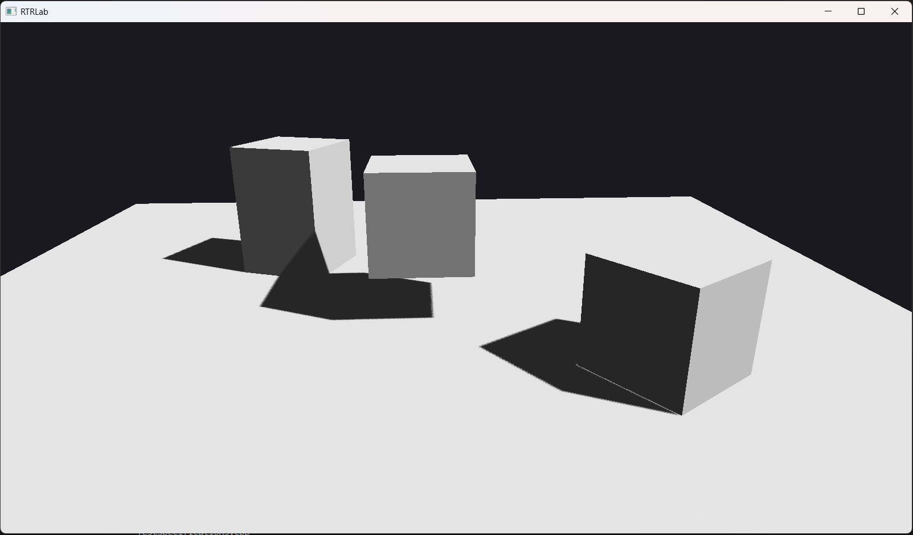

# 阴影贴图 Demo

RT Rendering Lab 的第一个 Demo —— 基于方向光的阴影贴图实现，
包含 Blinn-Phong 光照模型和 PCF 软阴影。

[English](../../en/demos/shadow-mapping.md)



---

## 概述

本 Demo 渲染一个简单场景（地面 + 立方体），由一盏方向光照亮，
并实现实时阴影贴图。它展示了完整的前向渲染管线：
从光源视角的深度 Pass，加上采样阴影贴图的前向光照 Pass，以及调试可视化模式。

### 渲染管线

```
SceneRenderer::Render(scene)
├── BuildDirectionalLightViewProjection()   → 构建光源空间 VP 矩阵
├── ShadowPass::Execute(scene, lightVP)     → 渲染 2048x2048 深度图（正面剔除）
├── ForwardPass::Execute(scene, shadowMap)   → 前向着色 + PCF 阴影采样
└── TexturePreviewPass::Execute(texture)     → 输出最终画面或阴影贴图预览
```

### 光照模型

**Blinn-Phong**，包含三个分量：

| 分量 | 公式 | 说明 |
|------|------|------|
| 环境光 | `0.15 * albedo` | 恒定的基础照明 |
| 漫反射 | `(1 - shadow) * NdotL * albedo * lightColor * intensity` | Lambert 漫反射 |
| 高光 | `(1 - shadow) * pow(dot(N, H), 32) * lightColor * intensity` | Blinn-Phong 镜面高光 |

---

## 阴影贴图技术

### 深度 Pass（ShadowPass）

1. 从方向光视角构建正交投影
2. 将所有场景几何体渲染到 2048x2048 的纯深度帧缓冲
3. 此 Pass 启用**正面剔除（Front Face Culling）**，有效减少自阴影伪影（Shadow Acne）

### 阴影采样（ForwardPass）

1. 使用光源 VP 矩阵将每个片元变换到光源空间
2. 将片元深度与阴影贴图进行比较
3. 应用**斜率缩放偏移**：`max(0.0001, 0.002 * (1 - NdotL))` 防止 Acne
4. 使用 **3x3 PCF**（百分比近邻滤波）实现柔和阴影边缘：

```glsl
float shadow = 0.0;
vec2 texelSize = 1.0 / textureSize(u_ShadowMap, 0);
for (int x = -1; x <= 1; ++x)
    for (int y = -1; y <= 1; ++y)
        shadow += currentDepth - bias > texture(u_ShadowMap, uv + vec2(x,y) * texelSize).r ? 1.0 : 0.0;
shadow /= 9.0;
```

### 调试可视化

按 **2** 切换到阴影贴图预览模式（深度缓冲以灰度显示）。
按 **1** 返回最终渲染输出。

---

## 操作说明

| 输入 | 动作 |
|------|------|
| W / A / S / D | 前 / 左 / 后 / 右移动相机 |
| Q / E | 下降 / 上升相机 |
| 鼠标 | 旋转视角（始终启用） |
| 滚轮 | 调整视场角（FOV） |
| 1 | 显示最终渲染输出 |
| 2 | 显示阴影贴图调试视图 |

---

## 场景设置

- **地面**：10x10 平面，位于 Y=0
- **3 个立方体**：不同位置、缩放和旋转
- **方向光**：方向 `(-0.8, -1.0, -0.4)`，白色，强度 1.0
- **相机**：初始位置 `(0, 2.5, 6)`，朝向原点

---

## 文件结构

```
src/demos/ShadowMapping/
├── ShadowMapping.h           # Demo 类声明
└── ShadowMapping.cpp         # 场景构建、输入处理、渲染调度

src/renderer/
├── SceneRenderer.h/cpp       # 多 Pass 渲染调度
└── passes/
    ├── ShadowPass.h/cpp      # 从光源视角的纯深度 Pass
    ├── ForwardPass.h/cpp     # 前向着色 + 阴影采样
    └── TexturePreviewPass.h/cpp  # 全屏纹理可视化

assets/shaders/
├── ShadowDepth.glsl          # 仅写入深度的精简着色器
├── ForwardLit.glsl           # Blinn-Phong + PCF 阴影采样
└── TexturePreview.glsl       # 全屏四边形纹理/深度可视化
```

---

## 关键实现细节

| 方面 | 细节 |
|------|------|
| 阴影贴图分辨率 | 2048 x 2048 |
| 阴影投影 | 正交投影，范围 10，近平面 0.1，远平面 30 |
| 偏移策略 | 斜率缩放：`max(0.0001, 0.002 * (1 - NdotL))` |
| PCF 核 | 3x3（9 次采样） |
| 阴影 Pass 剔除 | 正面剔除（无需大偏移即可减少 Acne） |
| 法线矩阵 | CPU 端预计算（`transpose(inverse(mat3(model)))`） |
| 纹理槽绑定 | `enum class TextureSlot` — `ShadowMap = 0`、`Albedo = 1` |
| 后备阴影贴图 | 1x1 白色纹理（深度 = 1.0 → 无阴影 Pass 时无阴影） |
